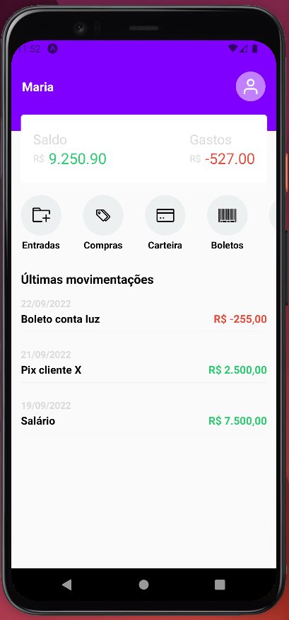

  <a href="#-tecnologias">Tecnologias</a>&nbsp;&nbsp;&nbsp;|&nbsp;&nbsp;&nbsp;
  <a href="#-projeto">Projeto</a>&nbsp;&nbsp;&nbsp;|&nbsp;&nbsp;&nbsp;
  <a href="#-como-rodar">Como rodar</a>&nbsp;&nbsp;&nbsp;|&nbsp;&nbsp;&nbsp;
  <a href="#-como-contribuir">Como contribuir</a>&nbsp;&nbsp;&nbsp;
  

 

  

## Finance Application Interface

## 🚀 Tecnologias

Esse projeto foi desenvolvido com as seguintes tecnologias:

- [React Native](https://reactnative.dev/)
- [Node.js](https://nodejs.org/en/) - v18.12.1
- [Npm](https://www.npmjs.com/) - 8.19.2
- [Expo](https://expo.dev/)

## 💻 Projeto

Projeto de uma interface de um app de finanças.

Aula do canal [Sujeito Programador](https://www.youtube.com/watch?v=REulDg3JzzQ&t=134s)

## 🚀 Como Rodar

- Clone o projeto;
- Rode npm install expo-cli --global (use yarn add se for de acordo com a sua configuração);
- expo start;
- pressione 'a' para abrir no Android;

Obs: caso dê erro no projeto após instalar o Moti, é só rodar npm i --legacy-peer-deps e rodar novamente o app.

## 🤔 Como contribuir

- Faça um fork desse repositório;
- Cria uma branch com a sua feature: `git checkout -b minha-feature`;
- Faça commit das suas alterações: `git commit -m 'feat: Minha nova feature'`;
- Faça push para a sua branch: `git push origin minha-feature`.

Depois que o merge da sua pull request for feito, você pode deletar a sua branch.

## 📝 Licença

Esse projeto está sob a licença MIT.